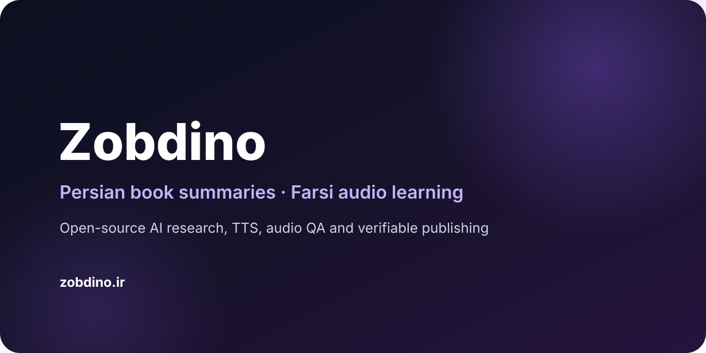

<div align="center">



# Zobdino · زبدینو

### Persian book summaries and audio learning, built in the open.

**AI-assisted research · Persian scripts · TTS · Audio QA · Verifiable releases**

[Website](https://zobdino.ir/) ·
[Product repository](https://github.com/Zobdino/Zobdino) ·
[Releases](https://github.com/Zobdino/Zobdino/releases)

</div>

---

## Build knowledge you can listen to

**Zobdino** is an open-source platform for **Persian / Farsi book summaries and short-form audio learning**.

Our publishing system connects legal research sources to Persian summary scripts, text-to-speech, audio mastering, automated QA and verifiable GitHub releases.

### What defines Zobdino

- 🇮🇷 **Persian-first** — native RTL UX and Farsi listening quality
- 🎧 **Audio-first** — concise, practical listening experiences
- 🤖 **Automation-first** — repeatable content and audio workflows
- 🔎 **Verifiable** — evidence, integrity checks and release artifacts
- ⚖️ **Copyright-aware** — no full-book redistribution
- 🌐 **Open Source** — engineering lifecycle visible on GitHub

## Publishing pipeline

```text
Official / Legal Sources
        ↓
Research & Source Pack
        ↓
Persian Summary Script
        ↓
Persian TTS
        ↓
Audio Mastering
        ↓
ASR / QA / Integrity
        ↓
Versioned Release Assets
        ↓
zobdino.ir
```

## Explore Zobdino

- 🌐 **Official website:** https://zobdino.ir/
- 📦 **Product repository:** https://github.com/Zobdino/Zobdino
- 🤝 **Contributing:** https://github.com/Zobdino/Zobdino/blob/main/CONTRIBUTING.md
- 🗺️ **Roadmap:** https://github.com/Zobdino/Zobdino/blob/main/ZOBDINO_MASTER_DOC.md


---

<div align="center">

**Zobdino · زبدینو**

Read less to discover more. Listen in Persian.

</div>